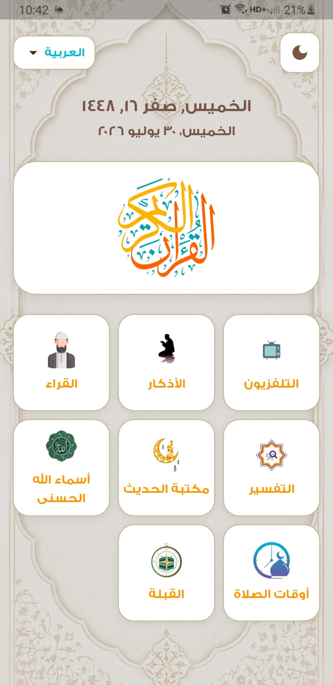
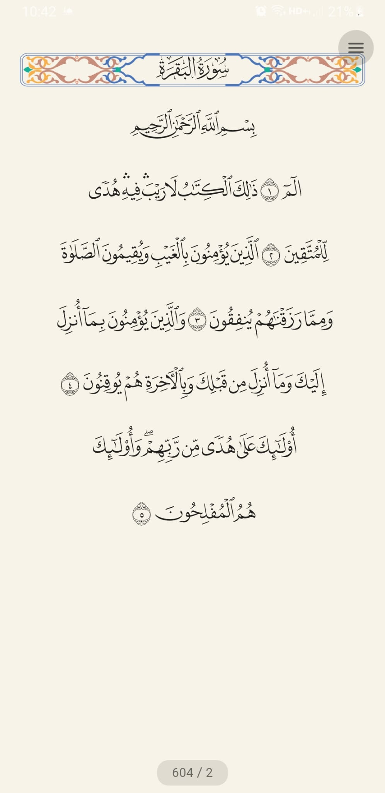
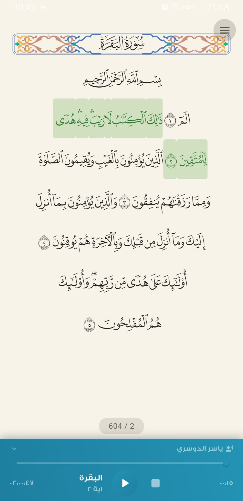
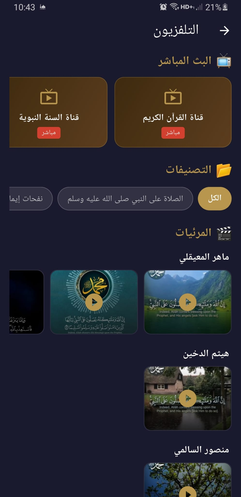

# 📖 Holy Quran & Islamic Content App

A high-performance, feature-rich Islamic application built with **Flutter & Dart**. Designed with clean architecture principles, it features full Quran reading, audio streaming & caching, live TV broadcasts, multi-language localization, and theme customization.

---

## ✨ Key Features

- **📖 Complete Quran Reading:** Clean typography and smooth pagination.
- **🔊 Audio Player & Offline Download:** Stream recitations from multiple Qaris with full offline capabilities powered by **Dio**.
- **📺 Live Islamic TV:** Smooth live streaming for Islamic channels.
- **🌙 Dynamic Theme Support:** Seamless switching between Light and Dark modes.
- **🌐 Multi-language Support:** Fully localized (Arabic / English) for global accessibility.
- **⚡ Offline First Approach:** Persistent storage and offline caching for uninterrupted listening.

---

## 🛠️ Architecture & Tech Stack

- **Framework:** [Flutter](https://flutter.dev) (Dart)
- **State Management:** `flutter_bloc` (BLoC Pattern for predictable state management)
- **Networking & Downloading:** `dio` (Handling API requests and audio downloads efficiently)
- **Local Storage & Caching:** 
  - `Hive` for fast key-value database storage (Reciters, bookmarks, & downloads)
  - `SharedPreferences` for user preferences (Theme & Language selection)
- **Localization:** `flutter_localizations`
- **Media Handling:** Custom audio playback with background execution & live video player

---

## 📱 App Screenshots

| Home Screen | Quran Reader | Audio Player | Live TV / Settings |
|:-----------:|:------------:|:------------:|:------------------:|
|  |  |  |  |

---

## 🚀 Getting Started

### Prerequisites
- Flutter SDK (latest version)
- Android Studio / VS Code

### Installation

1. **Clone the repository:**
   ```bash
   git clone [https://github.com/your-username/your-quran-app-repo.git](https://github.com/your-username/your-quran-app-repo.git)